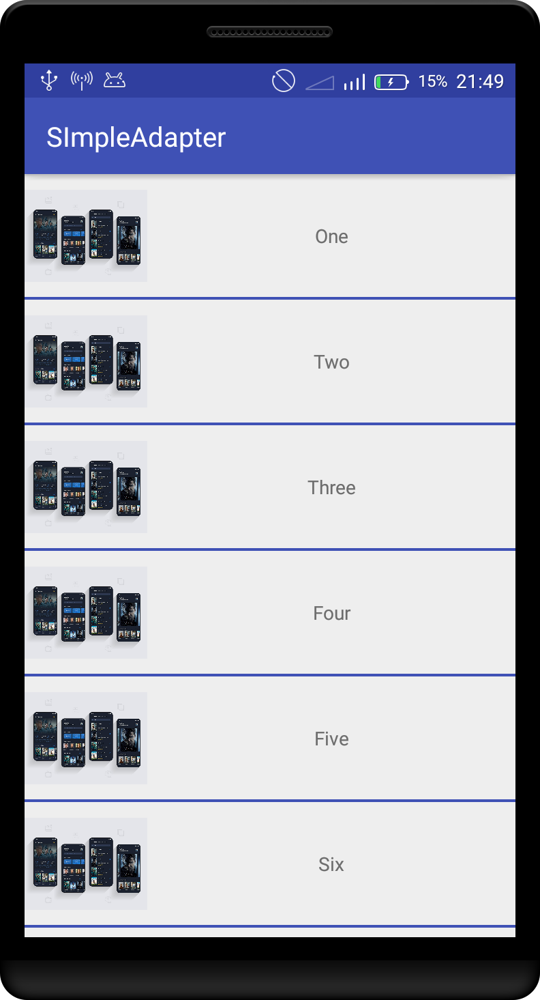
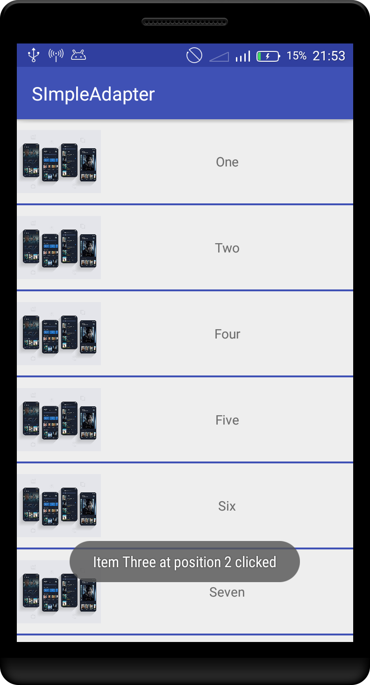

## SimpleAdapter
Simplified recyclerview adapter for android.  

[  ](https://bintray.com/carloscj6/Libs/SimpleAdapter/1.0.0/link)

## Table of Contents  
1. [Gradle dependency](#gradle-dependency)  
2. [Usage](#usage)  
3. [Methods](#methods)  
4. [Contribution](#contribution)  
5. [Author](#author)  
6. [Support](#support)  
7. [License](#license)  
  
<h3 id="gradle-dependency">Gradle-dependency</h3>  
   
```gradle  
dependencies {  
 ... 
 implementation "com.revosleap.adapter:SimpleAdapter:$latest_version"
 }  
```  
<h3 id="usage">Usage</h3>  
Your activity/fragment needs to implement `SimpleCallbacks` , which is the interface for handling the library's callbacks :smile:, like:  
  
> Kotlin  
```kotlin  
class MainActivity : AppCompatActivity(), SimpleCallbacks  
```  
> Java
```java  
class MainActivity extends AppCompatActivity implements SimpleCallbacks  
```  
### OR
> Kotlin
```kotlin
val callbacks = object: SimpleCallbacks{
	override fun onViewClicked(view: View, item: Any, position: Int) {}  
  
	override fun bindView(view: View, item: Any, position: Int) {}  
  
	override fun onViewLongClicked(it: View?, item: Any, position: Int) {}
}
```
This will implemet `onViewClicked` , `onViewLongClicked` and `bindView` methods.  
`bindView` handles binding data to the layout. It's called in the viewholder class and `onViewClicked` handles clicks on the layout parent.  
> Both methods receive `view` - the itemView, `item` - the object class and `position` - the position of he item in the list.  
  
Initialize the adapter as follows:  
> Kotlin  
```kotlin  
val simpleAdapter = SimpleAdapter(R.layout.list_item, callbacks)  
```  
> Java
```java  
SimpleAdapter simpleAdapter = new SimpleAdapter(R.layout.list_item, callbacks)  
```  
  
Attach the adapter to the recyclerview like below and you're good to go.  
> Kotlin  
```kotlin
 list.apply {    
	   adapter = simpleAdapter    
	  layoutManager = LinearLayoutManager(this@MainActivity)    
	  //of course you need a layout manager  
}  
```
>Java
```java
 list.setAdapter(simpleAdapter);    
 list.setLlayoutManager(new LinearLayoutManager(this@MainActivity)); 
```  
  
<h3 id="samples"> Samples</h3>  
  
> Kotlin  
```kotlin  
override fun onViewClicked(view: View, item: Any, position: Int) {    
    item as Person    
    Toast.makeText(applicationContext, "Item ${item.name} at position $position clicked", Toast.LENGTH_SHORT).show()    
	simpleAdapter!!.removeItem(item) // removes the clicked item from list
}  
```  
```kotlin
override fun onViewLongClicked(it: View?, item: Any, position: Int) {  
    item as Person  
    Toast.makeText(applicationContext, "Item ${item.name} at position $position long clicked", Toast.LENGTH_SHORT).show()  
}
```
```kotlin  
val person = Person(R.drawable.preview, "One") simpleAdapter!!.addItem(person)  
```  
  
```kotlin  
override fun bindView(view: View, item: Any, position: Int) {    
    item as Person // smart cast to access its attributes    
  val name = view.textView //textView is the ID of the View in the list item layout    
  val image = view.image //image is also an ID in the layout    
    
 //bind data to the views  name.text = item.name    
image.setImageResource(item.image) //both using modelName and item work }  
```  
  
   
  
<h3 id="methods">Methods</h3>  
  
All the methods provided by the library are:  
1. `addManyItems(list: MutableList<Any>)` - appends the received list to the existing one.  
2. `changeItems(list: MutableList<Any>)` - replaces the existing list with one received.   
3. `removeItem(position: Int)` - removes item at the specified position.  
4. `removeItem(item: Any)` - removes the received item from the list.  
5. `clearItems()` - removes all items in the list making it blank. :wink:  
6. `addItem(position: Int, item: Any)` - inserts the received item into the specified position within the list.  
7. `addItem(item: Any)` - appends the received item to the end of the list.  
  
<h3 id="contribution">Contribution</h3>  
  
1. Fork  
2. Create feature branch:  `git checkout -b my-feature-branch`  
3. Commit changes:  `git commit -am 'new awesome feature'`  
4. Push to the branch:  `git push origin my-feature-branch`  
5. Submit a pull request   
  
<h3 id="author">Author</h3>  
  
Made with :heart: by [Kevin Kiprotich](kevinkip.rf.gd)  
  
<h3 id="support">Support</h3>  
  
<a href="https://www.buymeacoffee.com/CHFudJf9j" target="_blank"></a>  
  
<h3 id="license"> License</h3>  
  
MIT License    
    
Copyright (c) 2018 Kevin Kiprotich    
    
Permission is hereby granted, free of charge, to any person obtaining a copy    
of this software and associated documentation files (the "Software"), to deal    
in the Software without restriction, including without limitation the rights    
to use, copy, modify, merge, publish, distribute, sublicense, and/or sell    
copies of the Software, and to permit persons to whom the Software is    
furnished to do so, subject to the following conditions:    
    
The above copyright notice and this permission notice shall be included in all    
copies or substantial portions of the Software.    
    
THE SOFTWARE IS PROVIDED "AS IS", WITHOUT WARRANTY OF ANY KIND, EXPRESS OR    
IMPLIED, INCLUDING BUT NOT LIMITED TO THE WARRANTIES OF MERCHANTABILITY,    
FITNESS FOR A PARTICULAR PURPOSE AND NONINFRINGEMENT. IN NO EVENT SHALL THE    
AUTHORS OR COPYRIGHT HOLDERS BE LIABLE FOR ANY CLAIM, DAMAGES OR OTHER    
LIABILITY, WHETHER IN AN ACTION OF CONTRACT, TORT OR OTHERWISE, ARISING FROM,    
OUT OF OR IN CONNECTION WITH THE SOFTWARE OR THE USE OR OTHER DEALINGS IN THE    
SOFTWARE.
